 

 

 

### 🎯 Open to Founding Engineer / Senior Full-Stack roles

I help founders take products from **idea → shipped**, fast. If you're building and need someone who can own the stack end-to-end, let's talk.

📅 **[Book a 15-min call — calendly.com/zafarkhanbusiness9](https://calendly.com/zafarkhanbusiness9)**

 

## 🚀 About Me

I'm a Full-Stack Engineer with 4+ years of experience designing and scaling AI-powered applications used by millions of users, across OTT, AI, GovTech, HealthTech, and SaaS. I specialize in **React.js / Next.js** on the frontend and **Node.js / Laravel** on the backend — focused on scalable architecture, performance, and clean UX.

Beyond client and team work, I build and ship my own products end-to-end — from idea, to code, to SEO and launch. I've been a **founding engineer** before and know how to move at startup speed while keeping things scalable.

- 🔭 Currently: **Senior MERN Stack Engineer @ [Myco.io](https://myco.io)**
- 🛠️ Founding Engineer @ **[MyBuzzly](https://mybuzzly.com)** — built entirely by me
- 🌱 Background: **BSIT, PUCIT** — FYP: *Travelary*
- 📫 Email: **zafarkhanbusiness9@gmail.com**
- 📱 Phone: **+92 305 5753869**
- 📅 Calendly: **[calendly.com/zafarkhanbusiness9](https://calendly.com/zafarkhanbusiness9)**
- 🌐 Portfolio: **[zafar-khan-senior-fullstack.vercel.app](https://zafar-khan-senior-fullstack.vercel.app/)**

 

## 🧰 Tech Stack

 

 

 

 

## 🤖 Deep into AI Engineering

I don't just use AI tools — I build with them. AI is a core part of how I ship products and how I work day to day:

- 🧠 Built **[ContentFlow](https://social-media.synquarailabs.com/)** — an AI command center that generates platform-native content, schedules it across every major social network, and tracks performance, all in one place
- 🔌 Use **MCP (Model Context Protocol)** to wire AI agents directly into real tools, codebases, and data sources
- ⚙️ Built my own **internal commands/agents** that automate large chunks of my day-to-day coding workflow — scaffolding, reviews, repetitive engineering tasks
- 🚀 Shipped AI-driven features across production products: AI-powered chatbot automation (Dubai business registration platform), video-interview AI hiring flow (**Talina**), and my own **AI Resume Fixer**

 

## 🛠️ Products I've Built

- **[MyBuzzly](https://mybuzzly.com)** — *Founding Engineer.* Newsletter + no-code website builder with built-in analytics & monetization
- **[ContentFlow](https://social-media.synquarailabs.com/)** — AI command center: generate content, schedule across every network, track performance
- **[AI Resume Fixer](https://airesumefixer.com)** — AI tool that tailors your resume to a specific job description
- **[StaffClock](https://staffclock.org)** — Employee time-tracking system, including a desktop app
- **[Cheesebase](https://cheesebase.com)** — Mobile health & fitness planner with AI-powered plans
- **[Mediknocx](https://www.mediknocx.com)** — Medical billing & revenue-cycle platform for US healthcare providers (also handled SEO — 100K+ impressions, thousands of clicks)
- **[Dr. Awadhesh Gupta MD](https://www.awadheshguptamd.com)** — Website for a NY-based internal medicine practice
- **[Master With Awais](https://masterwithawais.com)** — Course & mentorship platform for eBay selling
- **[Mangaloom](https://mangaloom.com)** — WordPress-based manga reading platform
- **[Draper TV](https://drapertv.com)** — Streaming platform for entrepreneurship content, including Tim Draper's "Meet the Drapers" pitch competition series
- **[Munchr](https://munchr.co)** — Food platform, currently in early access

*All built entirely by me, end-to-end, unless noted otherwise.*

 

## 💼 Professional Experience

**[Myco.io](https://myco.io)** — Senior MERN Stack Engineer&nbsp;&nbsp;·&nbsp;&nbsp;*Jan 2025 – Present&nbsp;&nbsp;·&nbsp;&nbsp;Lahore, Pakistan*
 `React.js` `Next.js` `TypeScript` `Node.js` `Express` `MongoDB`
- Led frontend development for a streaming platform supporting **1M+ monthly users**, architecting a Next.js-based component system that improved maintainability and development velocity.
- Revamped onboarding/auth flows (**-30% drop-off**) and integrated multiple payment gateways (**+25% transaction success rate**).
- Contributed to the React Native mobile & TV app used by **15M+ users**; led code reviews and authored technical documentation to accelerate team productivity.

**TechTics.ai** — Front-End Team Lead&nbsp;&nbsp;·&nbsp;&nbsp;*May 2023 – Jan 2025&nbsp;&nbsp;·&nbsp;&nbsp;Lahore, Pakistan*
 `React.js` `Next.js` `TypeScript` `Node.js` `Laravel`
- Led frontend development for AI-powered hiring platform **Talina**, reducing recruitment time by **50%** through automation and optimized workflows.
- Designed and deployed the **UHS Admissions Portal** (GovTech, Punjab) serving **40K+ annual users**, ensuring scalability, accessibility, and reliability under peak traffic.
- Built an AI-driven chatbot automation system for a Dubai-based business registration platform (**-70% manual workload**) and architected scalable, microservices-based chatbot infrastructure across multiple client sites.

**AZ TechZone** — Web Developer&nbsp;&nbsp;·&nbsp;&nbsp;*Feb 2022 – Dec 2022&nbsp;&nbsp;·&nbsp;&nbsp;Lahore, Pakistan*
 `React.js` `Next.js` `WordPress` `HTML` `CSS`
- Built mobile-first, responsive websites using HTML, CSS, JavaScript, and Webpack.
- Applied single-page application concepts to improve UX.
- Ensured accessibility and cross-browser compatibility.

**Also:** led development of **[FirmFox](https://firmfox.com)** (UAE business setup platform) as Frontend Lead, personally building ~60% of the application.

 

## 📊 GitHub Stats

I actively use three GitHub accounts — stats tools can't sum multiple accounts into one number, so here's each one. These cards are generated inside this repo by a GitHub Action (not the public demo service, which is unreliable), so they'll always load.

<b>Zafarkhan06</b> 

<b>Mediknocx</b> 

<b>contact769</b> 

  

 

